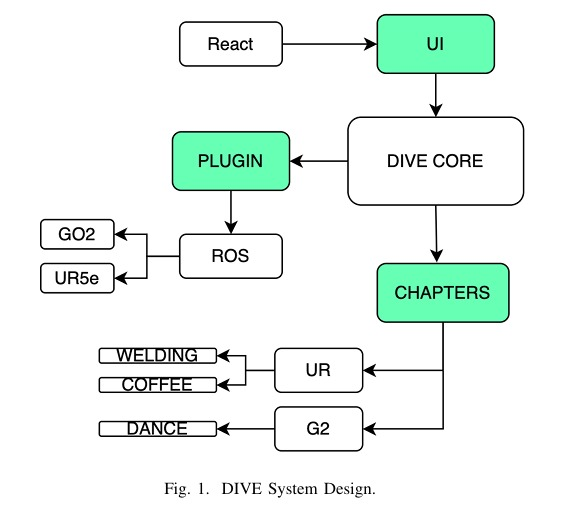

# Digital Interactive Virtual Education (DIVE) System

## Introduction
The Digital Interactive Virtual Education (DIVE) system is a web-based interactive learning platform designed to enhance robotics programming education. It leverages an intuitive UI/UX on a modular and extendable platform, allowing users to control robots virtually and learn programming concepts regardless of their educational or industrial background.

    

## Features
- **Intuitive Learning Modules:** Structured educational content guiding users through the intricacies of robot programming.
- **Modular Design:** Extendable platform supporting various robotics platforms and technologies.
- **Interactive UI/UX:** Designed to be user-friendly across web, mobile, and VR platforms.
- **Real-Time Feedback:** Immediate execution of code on industrial-grade robots for an immersive learning experience.
